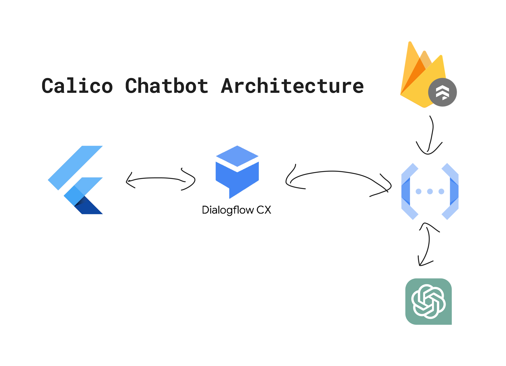

# Calico

---

Calico is a chatbot designed to assist users in understanding and managing their mental health. It provides appropriate responses and guidance. Users can chat with Calico and share their day, concerns, or problems. Calico will respond by listening, giving advice, and offering solutions to their stories to help users relieve their stress or anxiety.

## Features

---

- Authentication
  Users can authenticate with Google sign-in or by entering their email and password. Additionally, users have the option to sign in anonymously.
- Chatbot
  Users can interact with our chatbot by sending messages and receiving a response.
- Chat recap and summary
  We store our users' chat sessions in our database and then use our chatbot’s AI to create a summary and give insights based on those sessions.
- Mood Tracker
  Users can input their moods every day. The system stores their mood in a database, which can be used to provide statistics on their mood throughout the month.
- SOS button
  Our application offers an SOS button for emergencies regarding the user's safety. Pressing the button will redirect the user to either a guided grounding exercise or a call to the authorities
- Articles
  Our application offers informative articles on mental health and well-being.
- Professional Help
  Users can find the closest psychology experts through the list we provide, although at present, we are not providing accurate information, as this feature is still under development.
- Breathing Exercise
  Users can perform a guided breathing exercise to soothe their anxiety and overall improve their well-being.

## Setup

---

Here are the instructions for setting up our flutter application. However, we suggest downloading the app from this [link](https://drive.google.com/file/d/1wrb6lzI8sedru9hiuI0LOfUaIXRFB3-6/view?usp=share_link) instead.

1. Ensure that both Flutter and Android Studio are installed on your device and that you can run Flutter projects locally.
2. All requirements must be met to run the app. To verify that your system meets the requirements to run the app, run the following command.

   ```dart
   flutter doctor
   ```

3. Git clone the project into the directory of your choosing.

   ```dart
   git clone https://github.com/Zem-Jos/calico.git
   ```

4. Change the directory to "calico"

   ```dart
   cd calico
   ```

5. Create a `.env` file in the root folder, specifying the `DIALOGFLOW_AGENT_ID` and `DIALOGFLOW_LOCATION` environment variables.

   ```dart
   DIALOGFLOW_AGENT_ID=""
   DIALOGFLOW_LOCATION=""
   ```

6. Add a `dialog_flow_auth.json` file to the assets folder. For further information about this undisclosed auth file and the `.env` information mentioned previously, please contact us through our email (zemnjos@gmail.com).
7. Download all the required dependencies using the commands below.

   ```dart
   flutter clean
   flutter pub get
   ```

8. After downloading the required dependencies, run the code

   ```dart
   flutter run
   ```

## Application Architecture

---

[](https://file.notion.so/f/s/aa26ee2a-6156-492e-9893-24f95a223a40/Brainstorming.png?spaceId=a85faf36-cd79-4771-9c89-69ebfe74ab33&table=block&id=ed0e6118-d50c-49e7-916a-649f5e21ee18&expirationTimestamp=1679996884930&signature=MnhzC0q6Vbg-mmyyKPufYXvFrObg2DZJARli6RZa7eo&downloadName=Brainstorming.png)

### Flutter

Our application will run on a mobile interface since it is more convenient and accessible for the user. To meet this need, we will be using Flutter since it has cross-platform capabilities and great performance. Flutter is an open-source UI software development kit created by Google. It is used to develop cross-platform applications for Android, iOS, Linux, macOS, Windows, Google Fuchsia, and the web from a single codebase.

### Firebase

Firestore will be utilized as our main database for storing user information and chat logs. It's a NoSQL document database that provides real-time updates and seamless integration with other Google Cloud Platform services. This will allow us to easily retrieve user information and chat logs to improve our chatbot's performance and provide better recommendations to users.

We implemented Firebase Storage in addition to the Firestore service. This allowed us to store our article markdowns and images. As a result, we can easily retrieve and display articles and images within our application. Storing markdowns and images in Firebase Storage also enables us to manage them more efficiently without incurring high costs. This ensures that our application remains affordable and user-friendly.

We also use the Firebase Authentication service to authenticate our users. Firebase Authentication provides a quick and secure way for users to sign up and log in to our application. It offers multiple authentication methods, including email and password, Google sign-in, and anonymous sign-in. With Firebase Authentication, we can easily manage user authentication, and our users can access our app with ease.

### Dialogflow CX

We opted to use Dialogflow CX as the foundation for our system, recognizing its potential for growth and development. This platform enables our chatbot to offer personalized psychologist recommendations based on the user’s background and issues. Furthermore, developing a chatbot with Dialogflow CX is intuitive, and integrating it with other Google Cloud Platform services is a seamless process.

### Cloud Function

To facilitate webhook calls from Dialogflow CX, we rely on Cloud Functions, which eliminates the need for setting up our server, making it an effortless solution. Additionally, integrating with other platforms is seamless. Using the Cloud Platform, we link Dialogflow to GPT-3, GPT-3 to Firestore, and webhooks that require programming languages. For instance, we use Cloud Functions to furnish the chatbot's responses to queries such as "what is the current time?"

### GPT-3

As stated earlier, we will leverage the power of GPT-3 to aid in data collection during the initial phases of development. By integrating GPT-3 with Dialogflow CX, we will generate conversational responses to users. We are confident in our ability to fine-tune the model to ensure that the responses are both pertinent and valuable to users. Additionally, we will utilize GPT-3 to summarize and provide feedback on user conversations each day, further enhancing the user experience.

## Challenges

---

1. **Chatbot Development**

   Collecting a large volume of high-quality conversational data can be a significant challenge for mental health chatbot model development. This is because mental health conversations are often personal and private, and individuals may be hesitant to share their experiences and feelings with machines.

   **How we tackle that challenge**

   We are taking advantage of the latest advancement in GPT-3 to assist data collection for our system. In the early stage of development, we will fine-tune and apply the GPT-3 model in our applications. Furthermore, we will collect conversational chat and user feedback to create a high-quality dataset. If we have enough data we will replace GPT-3 with our own model.

1. **Chatbot Integration**

   Currently, Dialogflow CX doesn’t support integrations with flutter directly as it does with other applications. Most of the documentation and libraries support Dialogflow v2 whereas Dialogflow CX is accessed using the Dialogflow v3 API. We had quite a hard time since the documentation doesn’t explicitly mention integrations with flutter.

   **How we tackle that challenge**

   By referencing open-source libraries in GitHub, we have a general idea of how to connect the Dialogflow CX to our application using the rest API method mentioned in the documentation. Our current implementation is not perfect and there may be parts of the code that doesn’t abide by the best practices mentioned in the documentation.

1. **Cloud Credit**

   We didn't recieve our Google Cloud Credit request to the Google Solution Challenge team until Wed, Mar 15. Hence we got some difficulties in training and developing our chatbot model.

   **How we tackle that challenge**

   By applying to the Google Cloud Platform and use the free $300 cloud credits from the trial program to start our chatbot model training and development.

## Further Development

---

### Chatbot

1. Create our own custom model.
2. Annotate the data from Firestore (that was collected from the edge device).
3. We plan to replace or combine our own model with GPT-3.
4. Deploy the model to Dialogflow CX.
5. Connect mood input to the chatbot conversation

### Application

1. Local notification that remind users to interact with our application
2. Text-to-speech for chat
3. Collaborate with real psychologists
4. Implement Dialogflow integration best practice (client connects to Dialogflow through a server)
5. Community platform
