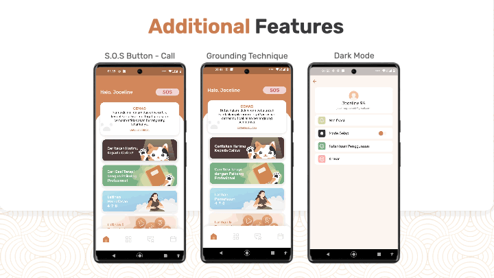

# Calico

---

Calico is a chatbot designed to assist users in understanding and managing their mental health. It provides appropriate responses and guidance. Users can chat with Calico and share their day, concerns, or problems. Calico will respond by listening, giving advice, and offering solutions to their stories to help users relieve their stress or anxiety.

## Features

---




## Application Architecture

---

[](https://file.notion.so/f/s/aa26ee2a-6156-492e-9893-24f95a223a40/Brainstorming.png?spaceId=a85faf36-cd79-4771-9c89-69ebfe74ab33&table=block&id=ed0e6118-d50c-49e7-916a-649f5e21ee18&expirationTimestamp=1679996884930&signature=MnhzC0q6Vbg-mmyyKPufYXvFrObg2DZJARli6RZa7eo&downloadName=Brainstorming.png)


## Setup

---

Here are the instructions for setting up our flutter application. However, we suggest downloading the app from this [link](https://drive.google.com/file/d/1DPIdKPOHvwthO1LTYMJJQTCIhwfOLeqg/view?usp=sharing) instead.

1. Ensure that both Flutter and Android Studio are installed on your device and that you can run Flutter projects locally.
2. All requirements must be met to run the app. To verify that your system meets the requirements to run the app, run the following command.

   ```dart
   flutter doctor
   ```

3. Git clone the project into the directory of your choosing.

   ```dart
   git clone https://github.com/Zem-Jos/calico.git
   ```

4. Change the directory to "calico"

   ```dart
   cd calico
   ```

5. Create a `.env` file in the root folder, specifying the `DIALOGFLOW_AGENT_ID` and `DIALOGFLOW_LOCATION` environment variables.

   ```dart
   DIALOGFLOW_AGENT_ID=""
   DIALOGFLOW_LOCATION=""
   ```

6. Add a `dialog_flow_auth.json` file to the assets folder. For further information about this undisclosed auth file and the `.env` information mentioned previously, please contact us through our email (zemnjos@gmail.com).
7. Download all the required dependencies using the commands below.

   ```dart
   flutter clean
   flutter pub get
   ```

8. After downloading the required dependencies, run the code

   ```dart
   flutter run
   ```

## Challenges

---

1. **Chatbot Development**

   Collecting a large volume of high-quality conversational data can be a significant challenge for mental health chatbot model development. This is because mental health conversations are often personal and private, and individuals may be hesitant to share their experiences and feelings with machines.

   **How we tackle that challenge**

   We are taking advantage of the latest advancement in GPT-3 to assist data collection for our system. In the early stage of development, we will fine-tune and apply the GPT-3 model in our applications. Furthermore, we will collect conversational chat and user feedback to create a high-quality dataset. If we have enough data we will replace GPT-3 with our own model.

1. **Chatbot Integration**

   Currently, Dialogflow CX doesn’t support integrations with flutter directly as it does with other applications. Most of the documentation and libraries support Dialogflow v2 whereas Dialogflow CX is accessed using the Dialogflow v3 API. We had quite a hard time since the documentation doesn’t explicitly mention integrations with flutter.

   **How we tackle that challenge**

   By referencing open-source libraries in GitHub, we have a general idea of how to connect the Dialogflow CX to our application using the rest API method mentioned in the documentation. Our current implementation is not perfect and there may be parts of the code that doesn’t abide by the best practices mentioned in the documentation.

1. **Cloud Credit**

   We didn't recieve our Google Cloud Credit request to the Google Solution Challenge team until Wed, Mar 15. Hence we got some difficulties in training and developing our chatbot model.

   **How we tackle that challenge**

   By applying to the Google Cloud Platform and use the free $300 cloud credits from the trial program to start our chatbot model training and development.

## Further Development

---

### Chatbot

1. Consider using Google Bard
2. Use Cloud Functions to connect edge device instead of Dialogflow CX directly
3. Add Psychologist recommendation based on user issues and background 

### Application

1. Local notification that remind users to interact with our application
2. Text-to-speech for chat
3. Collaborate with real psychologists
4. Implement Dialogflow integration best practice (client connects to Dialogflow through a server)
5. Community platform

# 👨‍👩‍👦 Contributors
<table width="100%">
    <thead>
    </thead>
    <tbody>
    <tr>
        <th>Name</th>
        <td width="100" align="center">Josiah</td>
        <td width="100" align="center">Jonathan</td>
        <td width="100" align="center">Hadzami</td>
        <td width="100" align="center">Jovinca</td>
    </tr>
    <tr>
        <th>Position</th>
        <td width="150" align="center">
            Mobile<br>
        </td>
        <td width="150" align="center">
            Mobile<br>
        </td>
        <td width="150" align="center">
            Backend<br>
        </td>
        <td width="150" align="center">
            Design<br>
        </td>
    </tr>
    <tr>
        <th>GitHub</th>
        <td width="100" align="center">
            <a href="https://github.com/josiahfs">
                
            </a>
        </td>
        <td width="100" align="center">
            <a href="https://github.com/jon-mun">
                
            </a>
        </td>
        <td width="100" align="center">
            <a href="https://github.com/hadhaz">
                
            </a>
        </td>
        <td align="center">
            <a href="https://github.com/vincalaudia">
                
            </a>
        </td>
     </tr>
    </tbody>
</table>
